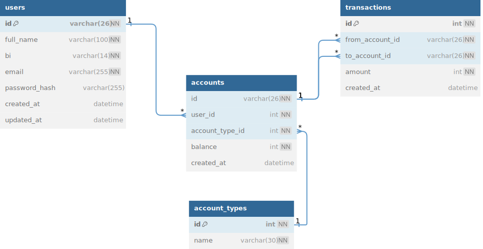

# Payment System

This project is a RESTful API built with **Node.js**, **Fastify**, **Prisma ORM**, and **Zod**. It manages user accounts and allows financial transactions between them. The API stores information about accounts and transactions, offering endpoints for account creation, balance viewing, and executing transactions between different user accounts.

The main goal of this API is to simulate a basic payment system between accounts, developed as part of a [technical challenge](https://github.com/PicPay/picpay-desafio-backend). In addition to being a practical solution, the project serves as a foundation for learning and improving backend skills, covering important concepts like system architecture, code best practices, performance optimization, queue management, and retry mechanisms. The payment context was chosen to make the challenge more interesting, but all the code can be reused and adapted for other types of financial or transactional operations.

## 1. About this project

This project is part of my personal portfolio, and I would greatly appreciate any feedback on the code, structure, or any other aspect that could help me become a better developer!

Feel free to contact me:

- **Email**: [mateuscelestinofreacker@gmail.com](mailto:mateuscelestinofreacker@gmail.com)
- **LinkedIn**: [Connect with me](https://www.linkedin.com/in/mateus-nelito)

Additionally, you are welcome to use this project however you'd like, whether for learning, improving it, or even for commercial purposes.

## 2. Getting started

To start using the Payment System API, follow the instructions below.

### Prerequisites

Before installing the project, ensure that you have the following item installed in your environment:

- **Node.js** (version 20.14.0 or higher)

### Installation

Follow the steps below to set up the project on your local machine:

1. **Clone the repository**:

   ```bash
   git clone https://github.com/mateusnelito/payment-system-backend.git
   ```

2. **Navigate to the project directory**:

   ```bash
   cd payment-system-backend
   ```

3. **Install the dependencies**:

   ```bash
   npm install
   ```

4. **Set up the environment**:

   - Create a `.env` file in the root of the project using the `.env.example` file as a template. Make sure that the environment variables are correctly set.

5. **Run the database migrations**:

   ```bash
   npm run db:migrate
   ```

6. **Seed the database with initial data**:

   ```bash
   npm run db:seed
   ```

   > **Note**: If you encounter an error in the log with the message **"Error: email or bi already exists."**, run the following command to reset the database, then run the seed command again:
   >
   > ```bash
   > npm run db:reset
   > ```

7. **View the database**:

   - You can use any database manager of your choice to access the database. If you don’t have one installed, you can run the following command to open Prisma Studio:

   ```bash
   npm run db:studio
   ```

   After running the command, Prisma Studio should automatically open in the browser. If it doesn't, you can **Ctrl+click** on the link to open it or copy and paste the link into your browser’s address bar. To stop the service and server, press **Ctrl + C** in the terminal.

8. **Start the server**:

   ```bash
   npm run start
   ```

Once the installation steps are complete, the API will be running at the default URL `http://localhost:3000/api`, unless the port has been changed. You can then start making calls to the defined endpoints.

## 3. API Documentation

- **Overview**: This project uses Swagger for API documentation. You can access the interactive documentation by visiting the [Swagger UI](http://localhost:3000/swagger).

- **Main Endpoints**:
    - **Users**
        - `POST /users`: Create a new user.
        - `GET /users/:userId`: Retrieve user information.

    - **Accounts**
        - `GET /users/:userId/accounts`: Show user accounts.
        - `POST /users/:userId/accounts`: Create an account for a user.

    - **Transactions**
        - `POST /transactions`: Create a new transaction.
        - `GET /accounts/:accountId/transactions`: Show account transactions.

- **Testing Endpoints**:

    - The `.http` files in the `request` folder contain HTTP documentation for all endpoints. These files can be used to test the endpoints directly in Visual Studio Code with the **REST Client** extension or in your preferred editor with a similar extension or plugin.

## 4. Database

The project uses **Prisma ORM** to manage the Payment System database, which is configured with **SQLite** by default. Below is the database schema diagram, illustrating the entities and relationships between them:



### Entity Descriptions

- **Users**: Stores information about users, such as full name, BI, email, and password.
- **Accounts**: Represents accounts associated with users, containing account type (referenced in the **AccountTypes** table) and balance.
- **AccountTypes**: Defines the allowed account types in the system, currently being `COMMON` and `MERCHANT`.
- **Transactions**: Records transactions between accounts, including the source account ID, destination account ID, and transaction amount.

For more details on the business rules and technical specifications, refer to the [official technical challenge](https://github.com/PicPay/picpay-desafio-backend).

## 5. Handling Monetary Values

To ensure precision and avoid truncation errors, the `balance` and `amount` values are stored as integers, representing the smallest unit of the currency. Thus, a value of 1,000 in any currency is stored as `100000` (i.e., 1,000 cents).

### Displaying Values

When consuming these values on the front-end or displaying them in a more readable format, the cents need to be converted to the main currency unit. To do this, divide the value by 100 and format it with two decimal places.

### Example in JavaScript

```javascript
// Value in cents
const balanceInCents = 100000; // Represents 1,000 (e.g., 1,000 kwanzas)

// Function to format the value in Kwanza
function formatCurrency(cents) {
  const kwanzas = cents / 100;
  return `Kz ${kwanzas.toFixed(2)}`; // Returns the formatted value with two decimal places
}

// Displaying the formatted balance
console.log(`Balance: ${formatCurrency(balanceInCents)}`); // Balance: Kz 1000.00

// To send values to the backend, convert to cents
const amountInKwanza = 75.25; // 75.25 kwanzas
const amountInCents = Math.round(amountInKwanza * 100); // Convert to cents
console.log(`Amount to be sent: ${amountInCents} cents`); // Amount to be sent: 7525 cents
```

## 6.  Roadmap / Next Steps

The project is constantly evolving, focusing on continuous learning and adding features to enhance the robustness and best practices in backend development. Below are the next planned steps for the payment system's development, organized to facilitate gradual learning:

1. **Authentication and Authorization**

   - **Goal**: Include authentication to protect endpoints, ensuring only authenticated users can perform financial operations.
   - **Step**: Implement JWT (JSON Web Tokens) authentication to control access to API resources, and ensure only authorized transactions can occur between accounts.

2. **Transaction Limits**

   - **Goal**: Introduce rules to limit the number of daily transactions or the total amount allowed per account.
   - **Step**: Add validations to control the transaction limit per day and/or the maximum amount that can be transferred, based on the account type or specific business rules.

3. **Queue Management and Retry**

   - **Goal**: Improve the system’s resilience and performance.
   - **Step**: Implement a queue for transaction management, handling transaction failures and integrating retry mechanisms to ensure operations are processed reliably.

4. **Include `status` Field for Audit Tracking**

    - **Goal**: Track the state of each transaction and improve auditing.
    - **Step**: Add a `status` field to the transaction entity to monitor the current state of a transaction (e.g., pending, completed, failed). This will provide better insights into transaction progress and financial flow.

5. **Logs and Monitoring**

   - **Goal**: Facilitate debugging and monitoring of the API in production.
   - **Step**: Add a solution for structured logs and integrate monitoring tools to track system performance and detect issues in real-time.

6. **Automated Testing**

   - **Goal**: Ensure code quality and robustness through testing.
   - **Step**: Create an automated test suite with **Jest** or **Mocha**, covering the system’s main functionalities (unit tests, integration tests, etc.).

7. **Support for Multiple Currencies**

   - **Goal**: Make the system flexible to support transactions in different currencies.
   - **Step**: Adapt the account and transaction model to support multiple currencies and allow value conversion when needed.

8. **Security Best Practices**

   - **Goal**: Implement recommended security practices to ensure the system is secure against common attacks.
   - **Step**: Introduce additional security controls, such as password encryption, sensitive data validation, and protection against vulnerabilities like SQL injection and brute force attacks.

## 7. Contribution

The project is open to contributions! Feel free to send as many Pull Requests (PRs) as you like. I’d be happy to review and accept your contributions! If you have any questions about the project or suggestions for improvements, don’t hesitate to contact me.

- **Email**: mateuscelestinofreacker@gmail.com
- **LinkedIn**: [Connect with me](https://www.linkedin.com/in/mateus-nelito)

Thanks for your help and interest!

## 8. License

This project is licensed under the [MIT License](LICENSE).
